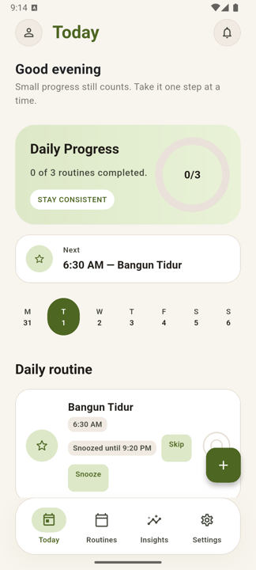
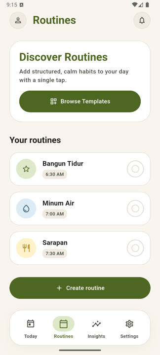
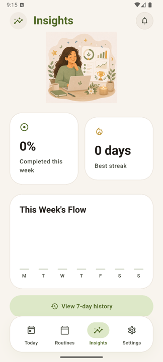
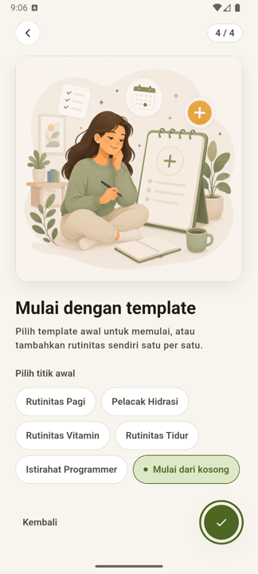
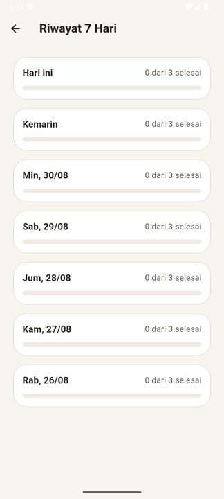

# OpenLife Routine

> Build better days, one routine at a time.

[](https://github.com/munandarh/openlife-routine-mobile-app/actions/workflows/flutter_ci.yml)
[](LICENSE)
[](https://flutter.dev)
[]()
[]()

**OpenLife Routine** is an open-source, privacy-first, offline-first daily routine
reminder app built with **Flutter**. It helps you manage meals, water, vitamins,
medicine, sleep, exercise, breaks, and lifestyle checklists — privately and
consistently.

> *No accounts. No cloud. No tracking. Just calm, on-device reminders.*

---

## 📸 Screenshots

Captured from the release build on an Android 16 emulator.

| Today | Routines | Insights |
|---|---|---|
|  |  |  |

The whole app is bilingual — including the onboarding starter-template step and
the 7-day history, shown here in Indonesian:

| Starter template (ID) | 7-day history (ID) |
|---|---|
|  |  |

---

## ✨ Features

| Feature | Description |
|---|---|
| 🏠 **Onboarding** | Language → notification permission → 3 value slides → starter template picker |
| 📋 **Today Checklist** | Progress ring, next-routine card, mark done / skip / snooze / undo, time-of-day greeting |
| 🔔 **Reminders** | Local notifications with snooze, rebuilt on every launch, timezone-safe, deep link on tap |
| ⏰ **Missed state** | A day that ends unanswered closes out as *missed* — and the sweep catches up on every day since you last opened the app |
| 📊 **Insights** | Weekly completion, daily chart, streak, most completed / most missed, 7-day history |
| 📦 **Templates** | 5 starter templates, applied in one tap from onboarding or the Templates screen |
| ⚙️ **Settings** | Theme, language, reduce motion, JSON export / import, reset, privacy, about |
| 🌍 **Bilingual** | Full English + Indonesian, including notification copy |
| ♿ **Accessible** | 44px targets, semantic labels, verified to 2× text scale, reduced-motion toggle |
| 🔒 **Privacy-first** | No accounts, no analytics, no tracking; data never leaves the device |
| 📱 **Offline-first** | Every core feature works with the radio off |

**Not yet shipped:** Rive `.riv` animations. `OpenLifeRiveView` has the Rive path
wired and falls back to the 10 bundled PNG illustrations — see
[`docs/animation-guidelines.md`](docs/animation-guidelines.md) §4 for the honest
status and what it takes to finish.

---

## 🧱 Architecture

| Layer | Technology |
|---|---|
| Framework | Flutter + Dart |
| State management | Full BLoC (no Cubit) |
| Database | Drift SQLite (schema v4) |
| Navigation | go_router |
| Notifications | flutter_local_notifications |
| Localization | `flutter gen-l10n` from ARB |
| Animation | Rive wrapper with PNG fallback |
| DI | Manual (`AppScope` + `AppDependencies`) |
| Testing | flutter_test, bloc_test, mocktail |
| CI | GitHub Actions |

```text
lib/
├── app/          # Composition root: app widget, router, bootstrap
├── core/         # DI, localization, notifications, database, theme
├── features/     # Feature-first modules, each with presentation/domain/data
├── l10n/         # ARB sources + generated localizations
└── shared/       # Reusable widgets, illustrations, navigation
```

📖 Deep dive: [`docs/architecture.md`](docs/architecture.md)

---

## 🚀 Quick Start

```bash
git clone https://github.com/munandarh/openlife-routine-mobile-app.git
cd openlife-routine-mobile-app

flutter pub get

# Code generation (only needed after changing a Drift table or an ARB file —
# the generated files are committed)
dart run build_runner build
flutter gen-l10n

flutter run

# Release build — split per ABI (45 MB for arm64 instead of a 91 MB fat APK)
flutter build apk --release --split-per-abi

# Play Store bundle
flutter build appbundle --release
```

> Release signing reads `android/key.properties` when present and falls back to
> debug keys (with a warning) when it is absent, so a fresh clone still builds.
> See [`docs/release-guide.md`](docs/release-guide.md) before publishing.

Requires the Flutter stable channel with Dart SDK ^3.11.

---

## 🧪 Testing

```bash
flutter test              # 348 tests
flutter analyze           # must be clean

flutter test test/features/today/          # one area
flutter test test/accessibility/           # text scaling + tap targets
flutter test test/l10n/                    # translation parity
```

CI runs `flutter analyze` and `flutter test` on every push and pull request.

---

## 📖 Documentation

| Doc | Description |
|---|---|
| [`docs/PRD.md`](docs/PRD.md) | Product requirements + MVP scope |
| [`docs/architecture.md`](docs/architecture.md) | Layers, data flow, lifecycle, testing strategy |
| [`docs/design-system.md`](docs/design-system.md) | Tokens, components, accessibility rules |
| [`docs/animation-guidelines.md`](docs/animation-guidelines.md) | Motion principles + Rive status |
| [`docs/contribution-guide.md`](docs/contribution-guide.md) | Long-form contributor guide |
| [`docs/release-guide.md`](docs/release-guide.md) | Signing, build, smoke test and publish |
| [`docs/SPRINT-CHECKLIST.md`](docs/SPRINT-CHECKLIST.md) | Implementation tracker against the PRD |
| [`docs/adr/`](docs/adr/) | Architecture Decision Records |
| [`ROADMAP.md`](ROADMAP.md) | What ships next |
| [`CHANGELOG.md`](CHANGELOG.md) | Version history |
| [`SECURITY.md`](SECURITY.md) | Security policy |
| [`CONTRIBUTING.md`](CONTRIBUTING.md) | Short contribution guide |
| [`CODE_OF_CONDUCT.md`](CODE_OF_CONDUCT.md) | Code of conduct |

---

## 🗺️ Roadmap

| Version | Focus |
|---|---|
| **v1.0** ✅ | MVP: routines, today checklist, reminders, insights, templates, settings, bilingual |
| **v1.1** | Rive animations, skip reason, search/filter, store release |
| **v1.2** | Smart reminders: escalation, dependent reminders, quiet hours |
| **v1.3** | Monthly insights, CSV/PDF export, home-screen widget |
| **v2.0** | Family / caregiver mode |
| **v3.0** | Optional encrypted cloud sync |

Full detail in [`ROADMAP.md`](ROADMAP.md).

---

## 🤝 Contributing

Contributions are welcome. Start with
[`CONTRIBUTING.md`](CONTRIBUTING.md), or
[`docs/contribution-guide.md`](docs/contribution-guide.md) for the full version.

`flutter analyze` and `flutter test` must both be clean before a PR is reviewed.

---

## 📜 License

Apache License 2.0 — see [`LICENSE`](LICENSE).

> *The source code is open source, but the OpenLife Routine name, logo, app icon,
> and official store listing are reserved for the official project.*

---

## 💼 Portfolio

OpenLife Routine was built as a production-quality open-source portfolio project
demonstrating:

- Flutter production app development, Android-first
- Clean Architecture with full BLoC
- Offline-first local persistence (Drift SQLite, 4 migrations)
- Local notification scheduling with snooze and timezone handling
- Complete bilingual UI, notifications included
- Accessibility verified by tests, not by assertion
- 348 unit, BLoC, widget, accessibility and localization tests
- Architecture Decision Records and maintained documentation
- CI on every push

> *"I built OpenLife Routine as an open-source Flutter app to help people manage
> daily routines, medication reminders, hydration, meals, and lifestyle
> checklists. It is offline-first and privacy-first, built with Clean
> Architecture, BLoC, a local database, and local notifications."*
